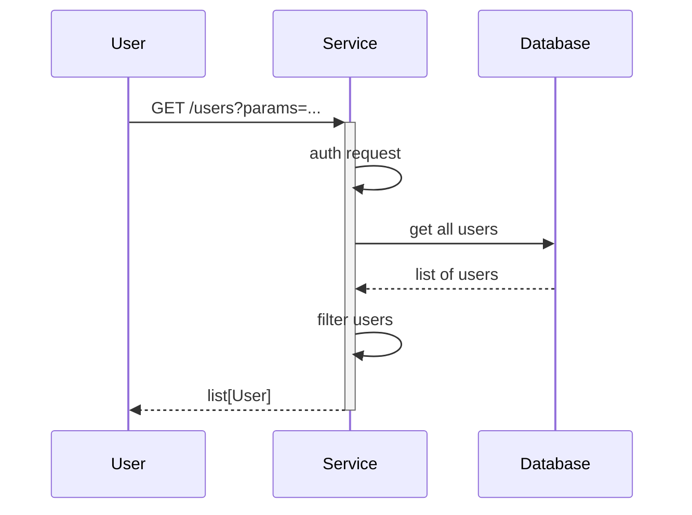

# clinical-data-common

[](https://github.com/NHSDigital/clinical-data-common/actions/workflows/cicd-1-pull-request.yaml)
[](https://sonarcloud.io/summary/new_code?id=clinical-data-common)

The `clinical-data-common` repository provides a centralized repository for common code used across various clinical data API products, such as [clinical-data-gateway-api](https://github.com/NHSDigital/clinical-data-gateway-api). It houses various Python sub-modules and Infrastructure as Code (IaC) configurations.

## Table of Contents

- [clinical-data-common](#clinical-data-common)
  - [Table of Contents](#table-of-contents)
  - [Setup](#setup)
    - [Prerequisites](#prerequisites)
    - [Configuration](#configuration)
  - [Usage](#usage)
    - [Testing](#testing)
    - [Code Quality](#code-quality)
  - [Design](#design)
    - [Diagrams](#diagrams)
    - [Modularity](#modularity)
  - [Contributing](#contributing)
  - [Contacts](#contacts)
  - [Licence](#licence)

## Setup

Clone the repository:

```shell
git clone https://github.com/NHSDigital/clinical-data-common.git
cd clinical-data-common
```

### Prerequisites

The following software packages, or their equivalents, are expected to be installed and configured:

- [Python](https://www.python.org/) 3.13 or later,
- [Poetry](https://python-poetry.org/) for dependency management,
- [GNU make](https://www.gnu.org/software/make/) 3.82 or later,

> [!NOTE]<br>
> The version of GNU make available by default on macOS is earlier than 3.82. You will need to upgrade it or certain `make` tasks will fail. On macOS, you will need [Homebrew](https://brew.sh/) installed, then to install `make`, like so:
>
> ```shell
> brew install make
> ```
>
> You will then see instructions to fix your [`$PATH`](https://github.com/nhs-england-tools/dotfiles/blob/main/dot_path.tmpl) variable to make the newly installed version available. If you are using [dotfiles](https://github.com/nhs-england-tools/dotfiles), this is all done for you.

### Configuration

Install dependencies:

```shell
make dependencies
```

## Usage

This package provides common utilities and functions for clinical data API products. It is designed to be imported as a dependency into other projects like `clinical-data-gateway-api`.

### Installing as a Dependency

To use `clinical-data-common` in your project, you can install it using Poetry:

#### Install from Git Repository

Add the following to your `pyproject.toml`:

```toml
[tool.poetry.dependencies]
clinical-data-common = { git = "https://github.com/NHSDigital/clinical-data-common.git", branch = "main" }
```

Or install via command line:

```shell
poetry add git+https://github.com/NHSDigital/clinical-data-common.git
```

You can also install a specific Tag/Version:

```shell
poetry add git+https://github.com/NHSDigital/clinical-data-common.git@v0.1.0
```

### Using the Module

Once installed, you can import and use the functions from `clinical-data-common` as follows:

```python
from clinical_data_common import get_hello

# Use the greeting function
greeting = get_hello()
message = f"{greeting}World"
print(message)  # Output: Hello, World
```

### Testing

There are `make` tasks for you to configure to run your tests.  Run `make test` to see how they work.  You should be able to use the same entry points for local development as in your CI pipeline.

#### Running Unit Tests

```shell
make test-unit
```

Or directly with Poetry:

```shell
poetry run pytest src/
```

#### Running Tests with Coverage

To run tests with code coverage reporting:

```shell
poetry run pytest --cov=clinical_data_common --cov-report=term --cov-report=html src/
```

This will generate:
- A terminal coverage report showing coverage percentages
- An HTML coverage report in the `htmlcov/` directory

To view the HTML coverage report:

```shell
open htmlcov/index.html
```

### Code Quality

This project uses [SonarCloud](https://sonarcloud.io) for continuous code quality and security analysis. The analysis runs automatically as part of the CI/CD pipeline on every pull request.

#### SonarCloud Integration

SonarCloud analyzes:
- Code quality and maintainability
- Security vulnerabilities
- Code coverage from unit tests
- Code smells and technical debt

The Quality Gate status is displayed at the top of this README. You can view detailed analysis reports on the [SonarCloud dashboard](https://sonarcloud.io/summary/new_code?id=clinical-data-common).

#### CI/CD Pipeline

The test pipeline (`.github/workflows/stage-2-test.yaml`) automatically:
1. Runs unit tests with coverage
2. Generates coverage reports in XML format
3. Uploads coverage data to SonarCloud
4. Performs static code analysis

Coverage reports are sent to SonarCloud and must meet the quality gate thresholds for pull requests to be merged.

## Design

### Diagrams

The [C4 model](https://c4model.com/) is a simple and intuitive way to create software architecture diagrams that are clear, consistent, scalable and most importantly collaborative. This should result in documenting all the system interfaces, external dependencies and integration points.


The source for diagrams should be in Git for change control and review purposes. Recommendations are [draw.io](https://app.diagrams.net/) (example above in [docs](.docs/diagrams/) folder) and [Mermaids](https://github.com/mermaid-js/mermaid). Here is an example Mermaids sequence diagram:



### Modularity

Most of the projects are built with customisability and extendability in mind. At a minimum, this can be achieved by implementing service level configuration options and settings. The intention of this section is to show how this can be used. If the system processes data, you could mention here for example how the input is prepared for testing - anonymised, synthetic or live data.

## Contributing

Describe or link templates on how to raise an issue, feature request or make a contribution to the codebase. Reference the other documentation files, like

- Environment setup for contribution, i.e. `CONTRIBUTING.md`
- Coding standards, branching, linting, practices for development and testing
- Release process, versioning, changelog
- Backlog, board, roadmap, ways of working
- High-level requirements, guiding principles, decision records, etc.

## Contacts

Provide a way to contact the owners of this project. It can be a team, an individual or information on the means of getting in touch via active communication channels, e.g. opening a GitHub discussion, raising an issue, etc.

## Licence

> The [LICENCE.md](./LICENCE.md) file will need to be updated with the correct year and owner

Unless stated otherwise, the codebase is released under the MIT License. This covers both the codebase and any sample code in the documentation.

Any HTML or Markdown documentation is [© Crown Copyright](https://www.nationalarchives.gov.uk/information-management/re-using-public-sector-information/uk-government-licensing-framework/crown-copyright/) and available under the terms of the [Open Government Licence v3.0](https://www.nationalarchives.gov.uk/doc/open-government-licence/version/3/).
